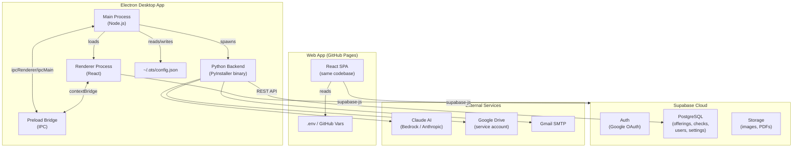
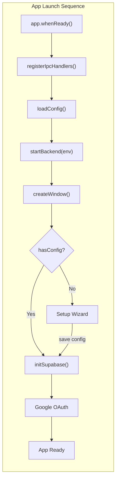
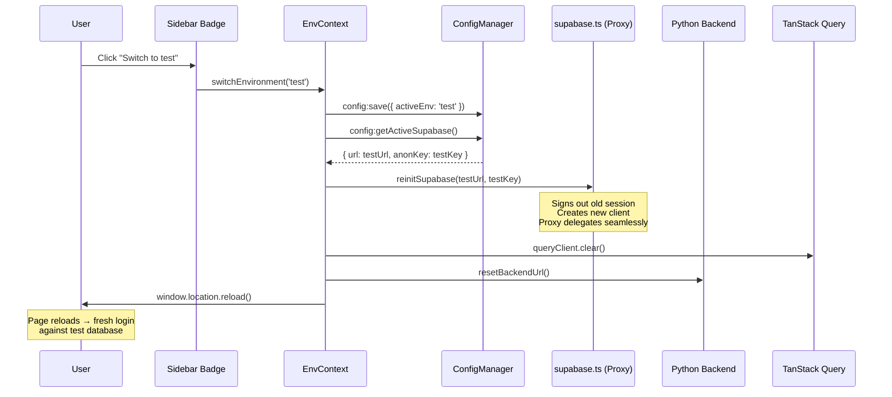
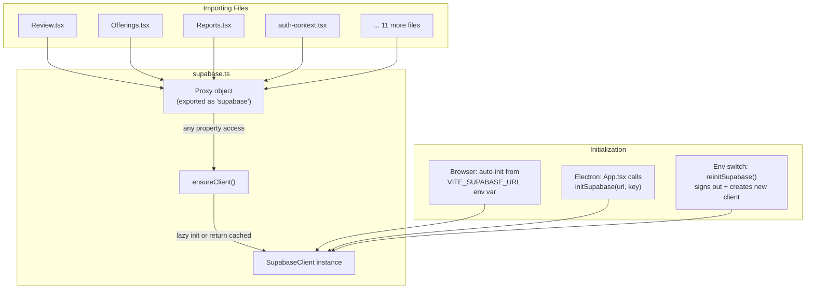
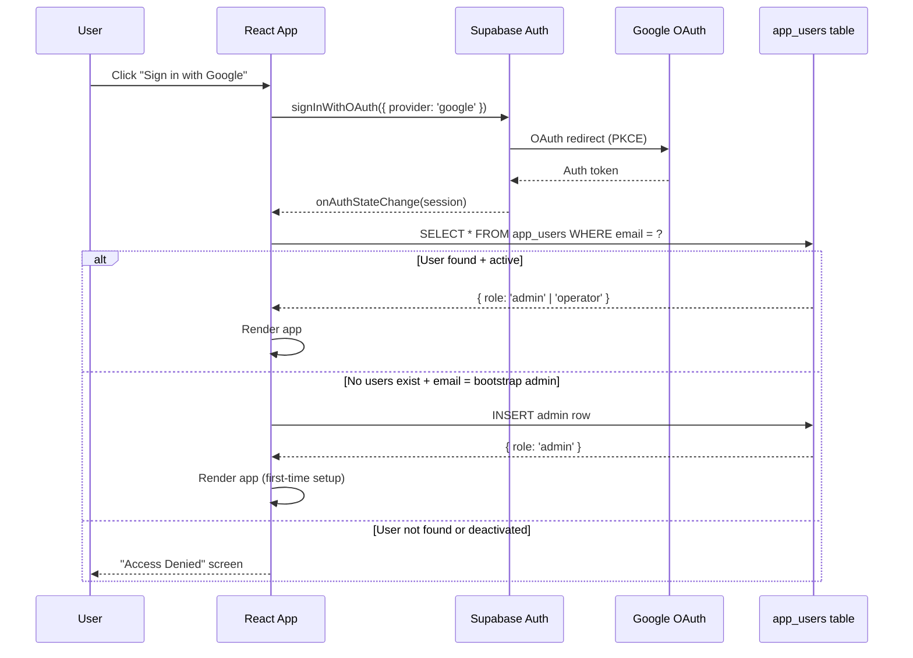
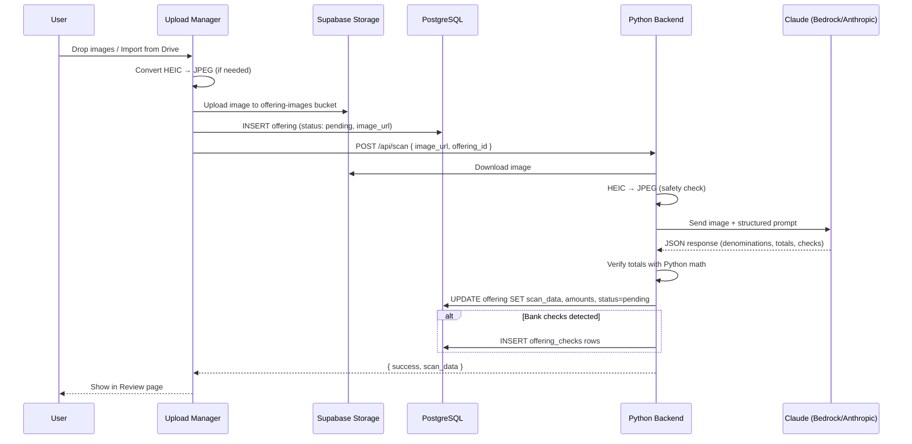
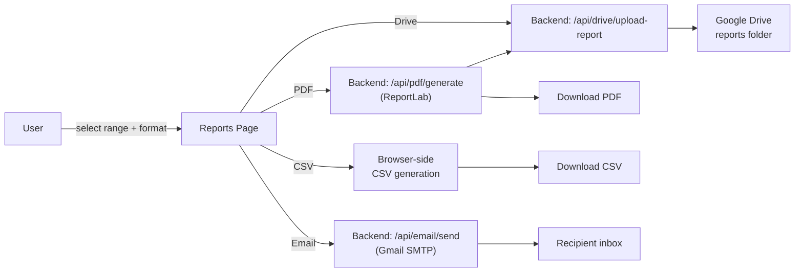
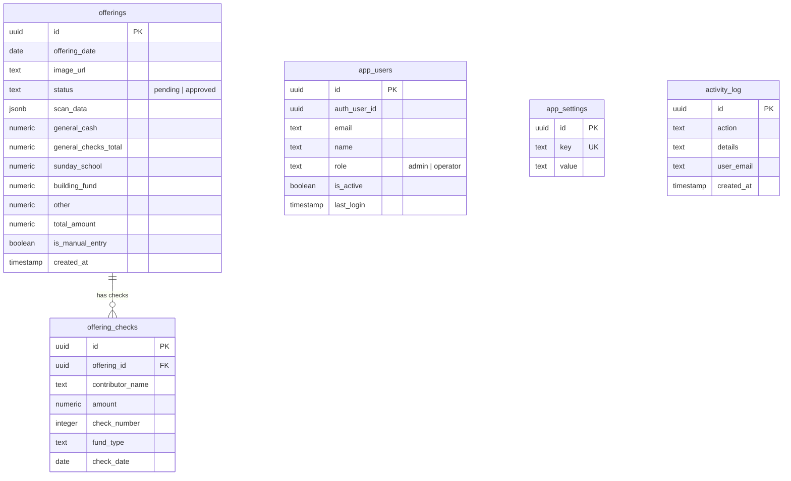

# OTS v3 Architecture

## Overview

OTS is a cloud-first, multi-user offering tracking system. It runs as a **web app** (GitHub Pages) or an **Electron desktop app** with a bundled Python backend. All data lives in Supabase Cloud (PostgreSQL + Auth + Storage). The desktop app supports switching between production and test databases.



## Electron Desktop Architecture

The desktop app wraps the same React frontend in Electron, with a bundled Python backend.



### Layer Responsibilities

| Layer | File | Role |
|-------|------|------|
| **Main Process** | `electron/main.ts` | App lifecycle, window creation, auto-updater, menu |
| **Backend Manager** | `electron/backend-manager.ts` | Spawn/kill Python binary, random port, health check |
| **Config Manager** | `electron/config-manager.ts` | Read/write `~/.ots/config.json` (0600 permissions) |
| **IPC Handlers** | `electron/ipc-handlers.ts` | Bridge: backend URL, config, version, update check |
| **Preload** | `electron/preload.ts` | Expose `window.electronAPI` via contextBridge |
| **Renderer** | `src/` (React) | UI — identical code for web and Electron |

### IPC Channels

```
Renderer → Main (invoke/handle):
  backend:getUrl        → returns http://127.0.0.1:{port}
  backend:getStatus     → health check result
  config:get            → full config object
  config:save           → merge + write config
  config:hasConfig      → boolean (prod url + key exist?)
  config:getActiveSupabase → { url, anonKey } for active env
  app:getVersion        → package.json version
  app:openExternal      → shell.openExternal(url)
  app:checkForUpdates   → GitHub API semver check

Main → Renderer (send/on):
  app:updateAvailable   → new version string
  app:updateReady       → downloaded version string
```

## Test/Prod Environment Switching

The desktop app can connect to two separate Supabase Cloud projects (e.g., one for production data, one for testing).



### Config File (`~/.ots/config.json`)

```json
{
  "supabase": {
    "prod": {
      "url": "https://xxx.supabase.co",
      "anonKey": "eyJ...",
      "serviceKey": "eyJ..."
    },
    "test": {
      "url": "https://yyy.supabase.co",
      "anonKey": "eyJ...",
      "serviceKey": "eyJ..."
    }
  },
  "activeEnv": "prod",
  "bootstrapAdmin": "jerome.purushotham@gmail.com",
  "theme": "dark"
}
```

### What Happens on Switch

1. **Config saved** — `activeEnv` flips from `prod` to `test` (or vice versa)
2. **Supabase client reinitialized** — new URL + anon key, old session signed out
3. **Query cache cleared** — TanStack Query cache purged so no stale prod data shows in test
4. **Backend URL reset** — cached port cleared (backend itself doesn't restart; it uses the service key passed at spawn)
5. **Page reloads** — clean state, user must sign in again against the new Supabase project
6. **Badge updates** — sidebar shows red "PROD" or orange "TEST" badge

### Visual Indicator

- **Red badge** = Production (real data)
- **Orange badge** = Test (safe to experiment)
- Admin sees a "Switch to test/prod" button below the badge
- Operators see the badge only (no switch button)

## Supabase Client — Proxy Pattern

The Supabase client uses a Proxy so 15+ files import `{ supabase }` without knowing whether it's been initialized yet.



**Browser mode:** First property access triggers `ensureClient()`, which reads `VITE_SUPABASE_URL` and auto-creates the client.

**Electron mode:** `App.tsx` fetches config via IPC, calls `initSupabase(url, anonKey)` before rendering. On env switch, `reinitSupabase()` replaces the underlying client — all importing files continue working through the Proxy.

## Authentication Flow



## Offering Scan Pipeline



### Scan Data Model

Each offering has independent sections:
- `general_cash` — bills (100x8, 50x2, 20x5, etc.)
- `general_checks` — check amounts with contributor names
- `sunday_school_cash` — Sunday School cash
- `building_fund_checks` — Building Fund checks
- `other_checks` — Miscellaneous

Python recalculates all totals from the denomination data — Claude's arithmetic is never trusted.

## Report Export Pipeline



## Database Schema



All tables have Row Level Security (RLS) — authenticated users can CRUD their data. Admin-only restrictions enforced in the frontend.

## Deployment Modes

```mermaid
graph TB
    subgraph Web["Web App (Browser)"]
        GHP["GitHub Pages<br/>jpurusho.github.io/ots"]
        GHA["GitHub Actions<br/>(auto-deploy on push)"]
        ViteEnv["Env vars from<br/>GitHub repo vars"]
        GHA -->|"npm run build"| GHP
        ViteEnv --> GHA
    end

    subgraph Desktop["Electron Desktop App"]
        Zip["OTS.app (zip)"]
        PyBin["Bundled ots-backend<br/>(PyInstaller)"]
        ConfigFile["~/.ots/config.json<br/>(no .env needed)"]
        Zip --- PyBin
        Zip --- ConfigFile
    end

    subgraph CI["CI/CD"]
        TagPush["git push tag v*"]
        ReleaseWF["release.yml workflow"]
        GHRelease["GitHub Release<br/>(zip artifact)"]
        TagPush --> ReleaseWF
        ReleaseWF -->|"build backend + electron"| GHRelease
    end

    subgraph Update["Auto-Update"]
        AppStart["App launches"]
        CheckAPI["GitHub Releases API"]
        Download["Download + install"]
        AppStart --> CheckAPI
        CheckAPI -->|"newer version"| Download
    end
```



### Development
```bash
npx supabase start              # Local Supabase (Docker)
cd backend && uvicorn main:app  # Python backend on :8000
npm run dev                     # Vite dev server on :5173
npm run dev:electron            # All of the above + Electron window
```

### Production Build
```bash
make build          # Build backend binary + Electron app
make build-run      # Build + launch locally
make build-push     # Build + tag + push GitHub release
```

### Web Deployment
Automatic on push to `main` via `.github/workflows/deploy.yml`. Builds React SPA, deploys to GitHub Pages at `/ots/`.

### Desktop Release
On push of a `v*` tag via `.github/workflows/release.yml`. Builds Python backend (PyInstaller) + Electron app on macOS, uploads zip to GitHub Releases.

## Cost

| Service | Cost |
|---------|------|
| Supabase Cloud (prod) | Free (500MB DB, 1GB storage) |
| Supabase Cloud (test) | Free (second project) |
| GitHub Pages | Free |
| GitHub Actions | Free (2000 min/month) |
| AI Scanning | Bedrock (dev, free) / Anthropic (~$0.01/scan) |

## Version History

- **v3.0.0** — Electron desktop app, bundled backend, config GUI, test/prod switching, light/dark theme, auto-update
- **v2.1.0** — Drive import, email, PDF reports, calendar view, expression parser, HEIC conversion
- **v2.0.0** — Cloud-first architecture with Supabase
- **v1.x** — Local-first with SQLite + PIN auth + Google Drive sync (see [ots-v0](https://github.com/jpurusho/ots-v0))
